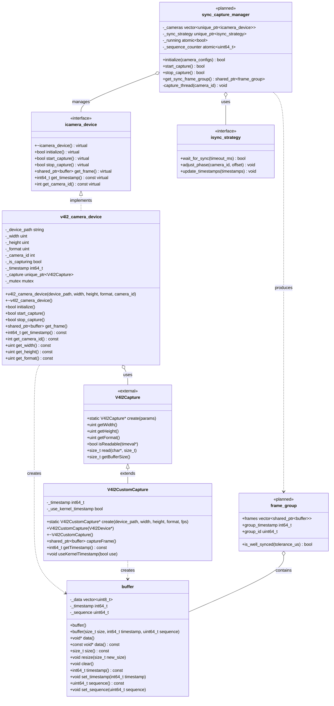

# 同步


- 系统整体流程
    - **初始化阶段**：
        - 服务器启动PTP主时钟
        - 各客户端启动并同步到PTP时钟
        - 客户端初始化并配置多个摄像头
    - **单客户端内同步采集**：
        - 使用同步屏障实现多摄像头同时采集
        - 为每一帧标记PTP时间戳
        - 形成同步帧组
    - **多客户端同步控制**：
        - 客户端向服务器报告帧组时间戳
        - 服务器计算各客户端间的相对偏差
        - 服务器向各客户端发送延迟调整指令
        - 客户端应用延迟调整，实现跨客户端帧对齐
    - **高效传输实现**：
        - 对齐后的视频帧进行压缩编码
        - 根据网络带宽动态调整编码质量
        - 通过高效传输协议向服务器发送同步帧
- 单客户端多摄像头同步（同步屏障法）
    
    同步屏障法确保单个客户端上的所有摄像头能够尽可能同时捕获图像：
    
    - **工作原理**：
        - 为每个摄像头创建独立的捕获线程
        - 使用同步屏障(Barrier)确保所有摄像头的采集触发尽可能同时进行
        - 所有摄像头线程到达屏障点后同时被释放进行采集
        - 采集完成后，为每一帧标记精确的PTP时间戳
        - 收集所有摄像头的帧，形成一个同步帧组
    - **优势**：
        - 确定性更强，不依赖时间戳匹配算法
        - 减少了帧存储需求，所有摄像头直接产生同步帧组
        - 降低了处理延迟，更接近实时性要求
    - **实现流程**：
        1. 初始化阶段，创建所有摄像头线程
        2. 进入同步循环：
            - 所有线程到达屏障点
            - 屏障释放，所有线程同时进行帧捕获
            - 捕获完成，附加PTP时间戳
            - 收集所有摄像头帧形成同步帧组
            - 将同步帧组传递给后续处理
    - 详细流程：单客户端多摄像头同步屏障实现
        
        客户端采集流程：
        
        1. 初始化多个摄像头设备
        2. 为每个摄像头创建捕获线程
        3. 主线程创建同步屏障，等待所有摄像头线程就绪
        4. 所有线程到达屏障点后同时释放
        5. 每个线程从对应摄像头读取一帧数据
        6. 为每一帧添加精确的PTP时间戳
        7. 所有线程完成帧采集后，收集形成同步帧组
        8. 将同步帧组传递给帧处理器（保存或网络传输）
        9. 重复步骤3-8
        
        同步屏障的关键是确保所有摄像头在同一时刻触发捕获操作，从而最大限度减少不同摄像头之间的时间偏差。由于同一客户端内的摄像头受相同CPU调度，这种方法能产生较好的同步效果。
        
- 多客户端之间的同步（服务器指令延迟调整）
    
    服务器通过计算各客户端时间戳偏差，下发延迟指令实现跨客户端同步：
    
    - **工作原理**：
        - 所有客户端使用PTP时间同步协议与服务器同步基础时钟
        - 客户端将自己的帧采集时间戳信息定期发送给服务器
        - 服务器分析所有客户端的时间戳，计算相对偏差
        - 服务器向各客户端发送延迟指令，指定每个客户端应额外延迟的时间
        - 客户端根据指令调整自己的帧发送时间，实现跨客户端的帧对齐
    - **优势**：
        - 通过延迟调整实现确定性同步，而非后期匹配
        - 利用了PTP时钟同步，保证了时间基准一致性
        - 可动态适应不同客户端的处理能力和网络状况
    - **实现流程**：
        1. 服务器启动PTP主时钟，所有客户端同步到该时钟
        2. 客户端每采集一组同步帧，向服务器发送采集时间戳
        3. 服务器收集所有客户端的时间戳信息
        4. 服务器计算各客户端相对于基准客户端的时间偏差
        5. 服务器向各客户端发送延迟指令
        6. 客户端接收指令，在帧发送前按指定时间延迟处理
    - 详细流程：多客户端同步机制
        
        服务器同步流程：
        
        1. 启动PTP主时钟服务
        2. 接收各客户端的帧时间戳信息
        3. 选择一个**客户端**作为参考（通常是延迟最小的客户端）
        4. 计算其他客户端相对于参考客户端的**时间戳偏差**
        5. 为每个**客户端**计算所需的**延迟调整值**
        6. 向各客户端发送**延迟调整指令**
        7. 定期重复步骤2-6，动态调整不同客户端间的同步
        
        客户端调整流程：
        
        1. 同步到服务器的PTP时钟
        2. 向服务器发送帧采集时间戳信息
        3. 接收服务器的延迟调整指令
        4. 在帧处理和发送前，按指定时间进行延迟
        5. 发送调整后的同步帧组
        
        服务器计算延迟调整值的关键是识别各客户端间的时间戳差异模式，并计算最优的延迟值，使所有客户端的帧能够对齐到相同的虚拟时间点。

# 客户端多像头同步采集实现指南

要实现客户端内的多摄像头同步采集功能，需要遵循以下原则、要求和编程指南，确保代码实现高效、稳定且满足系统同步需求。

## 核心设计原则

1. **同步优先原则**：将同步精度放在首位，即使会增加少量系统开销
2. **模块化设计**：将摄像头管理、同步机制、帧处理等功能分离为独立模块
3. **错误容忍设计**：系统应能处理摄像头临时失效等异常情况
4. **低延迟优先**：减少不必要的数据拷贝和处理步骤

## 具体实现要求

### 1. 同步屏障机制实现

- 使用C++11或更高版本的同步原语（`std::barrier`）
- 所有摄像头线程必须在同一时刻被释放进行采集
- 考虑线程调度延迟，可实现预调度机制
- 在精确的时间点释放屏障，确保采集同步性

### 2. 摄像头采集线程管理

- 为每个摄像头创建独立的高优先级线程
- 使用实时调度策略（如SCHED_FIFO），减少线程调度延迟
- 采用线程亲和性设置，将关键线程绑定到特定CPU核心
- 避免线程间不必要的锁竞争

### 3. 时间戳处理

- 使用单调时钟（monotonic clock）作为本地时间基准
- 为每个采集帧添加至少两个时间戳：
    - 采集开始时间戳（用于同步判断）
    - 采集完成时间戳（用于处理延迟分析）
- 维护本地时钟与PTP时钟的映射关系
- 确保时间戳精度至少达到微秒级

### 4. 内存管理与缓冲区优化

- 采用零拷贝或最少拷贝策略处理图像数据
- 使用内存池预分配帧缓冲区，避免频繁内存分配
- 考虑使用内存映射（mmap）直接访问摄像头缓冲区
- 针对不同格式的图像数据采用适当的缓冲区对齐策略

### 5. 跨客户端同步指令处理

- 实现指令接收和处理模块，接收服务器的延迟调整指令
- 设计精确的延迟执行机制，可基于高精度定时器
- 为延迟指令引入序列号，确保按正确顺序应用调整
- 维护延迟历史记录，用于分析和调试

## 编程技术指南

### 1. 低级别摄像头访问

- 使用V4L2 API直接控制USB摄像头，避免高层封装引入的不确定性
- 设置适当的缓冲区数量（通常4-8个）实现帧循环
- 使用`VIDIOC_QBUF`和`VIDIOC_DQBUF`控制缓冲区循环
- 考虑使用`select()`或`poll()`实现非阻塞式等待

### 2. 线程同步与调度

- 使用条件变量和互斥锁实现线程间的精确同步
- 针对关键线程设置实时调度优先级
- 使用`pthread_setaffinity_np()`绑定线程到特定CPU核心
- 避免在关键路径上使用重量级同步原语

```cpp
// 实时线程设置示例
void setRealtimeThreadPriority(pthread_t thread, int priority) {
    struct sched_param param;
    param.sched_priority = priority;
    pthread_setschedparam(thread, SCHED_FIFO, &param);
}

void setThreadAffinity(pthread_t thread, int cpuCore) {
    cpu_set_t cpuset;
    CPU_ZERO(&cpuset);
    CPU_SET(cpuCore, &cpuset);
    pthread_setaffinity_np(thread, sizeof(cpu_set_t), &cpuset);
}

```

### 3. 同步屏障精确控制

- 为屏障添加精确的时间控制，基于高精度计时器
- 实现预测性同步，计算下一个最佳同步点
- 考虑使用自适应等待策略，减少忙等待的CPU开销
- 使用`std::chrono::high_resolution_clock`获取高精度时间

```cpp
// 精确时间控制示例
void preciseWaitUntil(int64_t targetTimeNs) {
    auto now = std::chrono::high_resolution_clock::now();
    auto target = std::chrono::time_point<std::chrono::high_resolution_clock>(
                    std::chrono::nanoseconds(targetTimeNs));

    if (now < target) {
        // 大部分时间使用休眠等待
        auto sleepDuration = target - now - std::chrono::microseconds(50);
        if (sleepDuration.count() > 0) {
            std::this_thread::sleep_for(sleepDuration);
        }

        // 最后阶段使用自旋等待，确保精确性
        while (std::chrono::high_resolution_clock::now() < target) {
            // 短暂CPU暂停，降低能耗
            _mm_pause();
        }
    }
}

```

### 4. 错误处理与恢复机制

- 实现摄像头状态监控，检测设备异常
- 当单个摄像头失效时，系统应继续运行其他摄像头
- 设计自动恢复机制，定期尝试重连失效摄像头
- 使用结构化异常处理，避免单点失败导致系统崩溃

### 5. 日志与调试

- 记录详细的同步相关时间戳和事件
- 使用多级日志级别，平衡信息量和性能
- 为每个关键组件建立性能指标监控
- 开发特定的同步精度分析工具

## 性能优化指南

1. **减少缓存争用**：设计数据结构时考虑CPU缓存行对齐
2. **避免系统调用**：在关键路径上尽量减少系统调用次数
3. **预取优化**：对帧缓冲区使用预取指令提高访问速度
4. **SIMD加速**：使用SSE/AVX指令集加速图像处理和格式转换
5. **锁优化**：使用无锁数据结构或细粒度锁，减少锁竞争

## 测试与验证方法

1. **同步精度测试**：
    - 建立同步精度测量基准，如使用LED闪烁器
    - 分析不同摄像头间的帧时间差异，量化同步表现
    - 使用统计方法评估系统长期同步稳定性
2. **性能压力测试**：
    - 测试在最大分辨率和帧率下的同步表现
    - 评估系统在持续运行数小时后的稳定性
    - 模拟网络延迟波动，测试服务器延迟指令的适应性
3. **异常情况处理**：
    - 测试摄像头断开连接时的系统行为
    - 验证PTP时钟漂移情况下的同步维持能力
    - 测试高CPU/内存负载下的同步性能