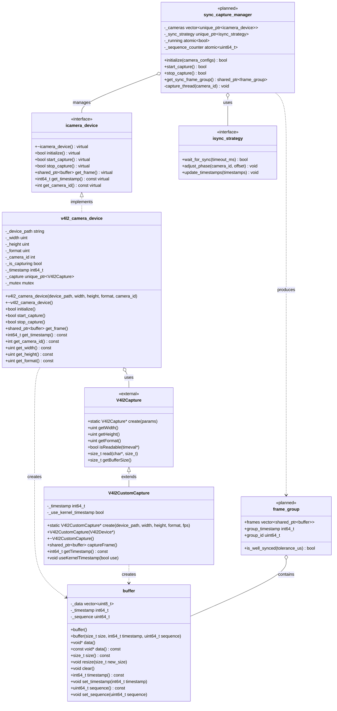

# 多摄像头同步采集系统

## 1. 项目概述

本项目旨在构建一个高精度多摄像头同步采集系统，支持单机多摄像头同步和多客户端跨设备同步。系统采用模块化设计，提供微秒级的帧同步精度，适用于3D重建、动作捕捉、多视角视觉等应用场景。

### 核心设计目标

- **高精度同步**：实现微秒级的摄像头帧同步
- **灵活扩展性**：支持多种摄像头类型和同步策略
- **分层同步架构**：单机内同步 + 多客户端跨设备同步
- **高效数据处理**：最小化内存拷贝，支持高分辨率、高帧率视频处理

## 2. 系统架构

### 2.1 架构图



## 3. 系统工作流程

### 3.1 单机多摄像头同步（主要采用屏障同步即可）

#### 实现步骤

1. **初始化阶段**
   ```cpp
   // 创建同步管理器
   auto manager = std::make_unique<sync_capture_manager>(BARRIER_SYNC);
   
   // 初始化多个摄像头并添加到管理器
   for (const auto& config : camera_configs) {
       auto camera = std::make_unique<v4l2_camera_device>(
           config.device_path, config.width, config.height, 
           config.format, config.camera_id);
       
       camera->initialize();
       manager->add_camera(std::move(camera));
   }
   
   // 初始化同步管理器
   manager->initialize();
   ```

2. **启动采集**
   ```cpp
   // 启动同步采集
   manager->start_capture();
   
   // 采集循环
   while (running) {
       // 获取同步帧组（带超时）
       auto frame_group = manager->get_sync_frame_group(100);
       if (!frame_group) {
           continue;
       }
       
       // 处理同步帧组
       process_frames(frame_group);
   }
   
   // 停止采集
   manager->stop_capture();
   ```

#### 3.1.1 屏障同步策略（Barrier Sync）

**原理**：使用同步屏障确保所有摄像头线程同时开始采集，最大限度减少时间偏差。

**具体实现**：
```cpp
class barrier_sync_strategy : public isync_strategy {
public:
    barrier_sync_strategy(size_t camera_count)
        : _target_cameras(camera_count), 
          _ready_count(0),
          _camera_ready(camera_count, false),
          _sync_point(0) {}

    bool wait_for_sync(int timeout_ms) override {
        std::unique_lock<std::mutex> lock(_mutex);
        
        // 通知当前线程已就绪
        int camera_id = get_current_camera_id();
        _camera_ready[camera_id] = true;
        _ready_count++;
        
        // 如果是最后一个到达的线程，设置下一个同步点
        if (_ready_count == _target_cameras) {
            // 设置下一个同步点为当前时间 + 固定偏移
            _sync_point = get_timestamp_us() + SYNC_POINT_OFFSET_US;
            _ready_count = 0;
            std::fill(_camera_ready.begin(), _camera_ready.end(), false);
            _cv.notify_all(); // 通知所有等待线程
        } else {
            // 等待直到所有摄像头就绪
            auto deadline = std::chrono::steady_clock::now() + 
                          std::chrono::milliseconds(timeout_ms);
            _cv.wait_until(lock, deadline, 
                        [this]() { return _ready_count == 0; });
        }
        
        // 如果有同步点，精确等待到同步点
        if (_sync_point > 0) {
            lock.unlock(); // 解锁以避免持有锁时自旋等待
            precise_wait_until(_sync_point);
            return true;
        }
        
        return false;
    }
    
    void notify_camera_ready(int camera_id) override {
        std::lock_guard<std::mutex> lock(_mutex);
        if (camera_id < _camera_ready.size()) {
            _camera_ready[camera_id] = true;
            _ready_count++;
            if (_ready_count == _target_cameras) {
                _sync_point = get_timestamp_us() + SYNC_POINT_OFFSET_US;
                _ready_count = 0;
                std::fill(_camera_ready.begin(), _camera_ready.end(), false);
                _cv.notify_all();
            }
        }
    }

private:
    std::mutex _mutex;
    std::condition_variable _cv;
    size_t _target_cameras;
    std::atomic<size_t> _ready_count;
    std::vector<bool> _camera_ready;
    int64_t _sync_point; // 微秒时间戳
    
    static constexpr int64_t SYNC_POINT_OFFSET_US = 5000; // 5ms预留时间
};
```

**同步管理器中的使用方式**：
```cpp
void sync_capture_manager::capture_thread(int camera_id) {
    // 设置线程优先级和亲和性
    setRealtimeThreadPriority(pthread_self(), 90);
    setThreadAffinity(pthread_self(), camera_id % get_cpu_cores());
    
    while (_running) {
        // 1. 等待同步点
        if (!_sync_strategy->wait_for_sync(100)) {
            continue;
        }
        
        // 2. 同步点到达，所有摄像头同时开始采集
        auto start_time = get_timestamp_us();
        auto frame = _cameras[camera_id]->get_frame();
        
        if (frame) {
            // 设置精确的捕获时间戳
            frame->set_timestamp(start_time);
            frame->set_sequence(_sequence_counter.fetch_add(1));
            
            // 添加到当前帧组
            std::lock_guard<std::mutex> lock(_mutex);
            if (_current_frame_group) {
                _current_frame_group->add_frame(camera_id, std::move(frame));
                
                // 如果帧组完整，推送到队列
                if (_current_frame_group->is_complete()) {
                    _frame_groups.push(_current_frame_group);
                    _current_frame_group = std::make_shared<frame_group>(_cameras.size());
                    _cv.notify_one();
                }
            }
        }
    }
}
```

**优势**：
- 同步精度高，理论上可达到微秒级
- 确定性强，不依赖后期时间戳匹配
- 适合延迟稳定的本地摄像头

**限制**：
- 需要所有摄像头都能正常工作
- 对系统调度敏感

#### 3.1.2 时间窗口同步策略（Time Window Sync）

**原理**：为每个摄像头独立采集，通过时间窗口匹配相近时间的帧组成同步组。

**具体实现**：
```cpp
class timestamp_sync_strategy : public isync_strategy {
public:
    timestamp_sync_strategy(int64_t tolerance_us = 1000)
        : _tolerance_us(tolerance_us), _running(true) {
        _sync_thread = std::thread(&timestamp_sync_strategy::sync_loop, this);
    }
    
    ~timestamp_sync_strategy() {
        _running = false;
        if (_sync_thread.joinable()) {
            _sync_thread.join();
        }
    }
    
    bool wait_for_sync(int timeout_ms) override {
        // 时间窗口策略不需要等待，直接返回
        return true;
    }
    
    void add_frame(int camera_id, std::shared_ptr<buffer> frame) {
        std::lock_guard<std::mutex> lock(_mutex);
        _camera_frames[camera_id] = frame;
        
        // 尝试形成帧组
        try_form_frame_groups();
    }
    
    std::shared_ptr<frame_group> get_frame_group(int timeout_ms) {
        std::unique_lock<std::mutex> lock(_mutex);
        if (_frame_groups.empty()) {
            _cv.wait_for(lock, std::chrono::milliseconds(timeout_ms),
                       [this]() { return !_frame_groups.empty(); });
        }
        
        if (_frame_groups.empty()) {
            return nullptr;
        }
        
        auto group = _frame_groups.front();
        _frame_groups.pop();
        return group;
    }

private:
    void try_form_frame_groups() {
        // 检查是否有足够的帧
        if (_camera_frames.size() < _min_cameras) {
            return;
        }
        
        // 找出所有帧的最小和最大时间戳
        int64_t min_ts = std::numeric_limits<int64_t>::max();
        int64_t max_ts = 0;
        
        for (const auto& [camera_id, frame] : _camera_frames) {
            int64_t ts = frame->timestamp();
            min_ts = std::min(min_ts, ts);
            max_ts = std::max(max_ts, ts);
        }
        
        // 如果时间戳差异在容差范围内，形成帧组
        if (max_ts - min_ts <= _tolerance_us) {
            auto group = std::make_shared<frame_group>(_camera_frames.size());
            for (auto& [camera_id, frame] : _camera_frames) {
                group->add_frame(camera_id, frame);
            }
            group->group_timestamp = min_ts;
            group->group_id = _next_group_id++;
            
            _frame_groups.push(group);
            _camera_frames.clear();
            _cv.notify_one();
        }
    }
    
    void sync_loop() {
        while (_running) {
            // 定期检查过期帧
            std::this_thread::sleep_for(std::chrono::milliseconds(5));
            
            std::lock_guard<std::mutex> lock(_mutex);
            if (_camera_frames.empty()) {
                continue;
            }
            
            // 查找最老的帧
            int64_t now = get_timestamp_us();
            int64_t oldest_ts = now;
            
            for (const auto& [camera_id, frame] : _camera_frames) {
                oldest_ts = std::min(oldest_ts, frame->timestamp());
            }
            
            // 如果最老的帧已经超过超时时间，强制形成帧组
            if (now - oldest_ts > _max_wait_us) {
                try_form_frame_groups();
            }
        }
    }

    std::mutex _mutex;
    std::condition_variable _cv;
    std::map<int, std::shared_ptr<buffer>> _camera_frames;
    std::queue<std::shared_ptr<frame_group>> _frame_groups;
    int64_t _tolerance_us;
    size_t _min_cameras = 2;
    int64_t _max_wait_us = 100000; // 100ms最大等待
    uint64_t _next_group_id = 0;
    std::atomic<bool> _running;
    std::thread _sync_thread;
};
```

**同步管理器中的使用方式**：
```cpp
void sync_capture_manager::capture_thread(int camera_id) {
    while (_running) {
        // 获取帧，不需要等待同步点
        auto frame = _cameras[camera_id]->get_frame();
        if (!frame) {
            std::this_thread::sleep_for(std::chrono::milliseconds(5));
            continue;
        }
        
        // 添加到时间窗口同步器
        auto ts_strategy = dynamic_cast<timestamp_sync_strategy*>(_sync_strategy.get());
        if (ts_strategy) {
            ts_strategy->add_frame(camera_id, std::move(frame));
        }
    }
}

std::shared_ptr<frame_group> sync_capture_manager::get_sync_frame_group(int timeout_ms) {
    auto ts_strategy = dynamic_cast<timestamp_sync_strategy*>(_sync_strategy.get());
    if (ts_strategy) {
        return ts_strategy->get_frame_group(timeout_ms);
    }
    return nullptr;
}
```

**优势**：
- 容错性高，单个摄像头失效不影响整体
- 不要求精确的线程同步
- 适应摄像头帧率不一致的情况

**限制**：
- 同步精度取决于时间窗口大小
- 可能会丢弃部分帧以保持同步
- 需要更多的缓存管理

#### 3.1.3 混合同步策略

将屏障同步和时间窗口同步结合，充分发挥各自优势：

**原理**：
- 使用同步屏障尽量使摄像头在同一时刻开始采集
- 同时使用时间窗口机制作为后备，处理可能的同步误差
- 动态调整同步参数，适应系统状态变化

**具体实现**：
```cpp
class hybrid_sync_strategy : public isync_strategy {
public:
    hybrid_sync_strategy(size_t camera_count, int64_t tolerance_us = 1000)
        : _barrier(camera_count), 
          _timestamp_sync(tolerance_us),
          _use_barrier(true),
          _performance_monitoring(true) {}
    
    bool wait_for_sync(int timeout_ms) override {
        if (_use_barrier) {
            return _barrier.wait_for_sync(timeout_ms);
        } else {
            return true; // 时间窗口模式不需要等待
        }
    }
    
    void notify_camera_ready(int camera_id) override {
        if (_use_barrier) {
            _barrier.notify_camera_ready(camera_id);
        }
    }
    
    void add_frame(int camera_id, std::shared_ptr<buffer> frame) {
        _timestamp_sync.add_frame(camera_id, std::move(frame));
        
        if (_performance_monitoring) {
            // 记录性能数据，用于动态调整
            monitor_sync_performance(camera_id, frame->timestamp());
        }
    }
    
    std::shared_ptr<frame_group> get_frame_group(int timeout_ms) {
        return _timestamp_sync.get_frame_group(timeout_ms);
    }

private:
    void monitor_sync_performance(int camera_id, int64_t timestamp) {
        std::lock_guard<std::mutex> lock(_monitor_mutex);
        
        // 记录最新时间戳
        _latest_timestamps[camera_id] = timestamp;
        
        // 如果有足够数据，分析同步精度
        if (_latest_timestamps.size() >= 2 && 
            _performance_samples.size() >= PERFORMANCE_SAMPLE_SIZE) {
            
            // 计算平均同步精度
            int64_t avg_precision = calculate_average_precision();
            
            // 根据精度动态调整同步策略
            if (avg_precision > PRECISION_THRESHOLD_US && _use_barrier) {
                // 精度不佳，切换到时间窗口模式
                _use_barrier = false;
                log_debug("Switching to timestamp sync due to poor precision");
            } else if (avg_precision <= PRECISION_THRESHOLD_US && !_use_barrier) {
                // 精度良好，切回屏障模式
                _use_barrier = true;
                log_debug("Switching back to barrier sync");
            }
            
            // 清除旧样本
            _performance_samples.clear();
        }
        
        // 如果收集到所有摄像头的时间戳，计算最大差异并记录
        if (_latest_timestamps.size() == _camera_count) {
            int64_t min_ts = std::numeric_limits<int64_t>::max();
            int64_t max_ts = 0;
            
            for (const auto& [id, ts] : _latest_timestamps) {
                min_ts = std::min(min_ts, ts);
                max_ts = std::max(max_ts, ts);
            }
            
            _performance_samples.push_back(max_ts - min_ts);
            _latest_timestamps.clear();
        }
    }
    
    int64_t calculate_average_precision() {
        if (_performance_samples.empty()) {
            return 0;
        }
        
        int64_t sum = 0;
        for (int64_t sample : _performance_samples) {
            sum += sample;
        }
        return sum / _performance_samples.size();
    }

    barrier_sync_strategy _barrier;
    timestamp_sync_strategy _timestamp_sync;
    std::atomic<bool> _use_barrier;
    std::atomic<bool> _performance_monitoring;
    
    // 性能监控相关
    std::mutex _monitor_mutex;
    std::map<int, int64_t> _latest_timestamps;
    std::vector<int64_t> _performance_samples;
    size_t _camera_count;
    
    static constexpr size_t PERFORMANCE_SAMPLE_SIZE = 100;
    static constexpr int64_t PRECISION_THRESHOLD_US = 5000; // 5ms
};
```

**使用方式**：
```cpp
// 创建混合同步策略
auto manager = std::make_unique<sync_capture_manager>(HYBRID_SYNC);

// 调整参数
auto hybrid_strategy = dynamic_cast<hybrid_sync_strategy*>(manager->get_sync_strategy());
if (hybrid_strategy) {
    hybrid_strategy->set_tolerance(2000);  // 2ms容差
    hybrid_strategy->enable_performance_monitoring(true);
}
```

**优势**：
- 兼具屏障同步的高精度和时间窗口的容错性
- 自适应调整，根据系统状态选择最优策略
- 适用于更广泛的应用场景

### 3.2 多客户端跨设备同步

#### 3.2.1 PTP时钟同步基础

**原理**：在多客户端系统中，首先通过PTP协议（IEEE 1588）建立统一的时间基准，然后基于这个共同时间域计算精确的时间偏移，实现多客户端间的同步。

**时钟同步实现**：
```cpp
class ptp_clock_sync {
public:
    ptp_clock_sync(const std::string& interface, bool is_master = false)
        : _interface(interface), _is_master(is_master), _running(false) {}
    
    bool start() {
        if (_running) return true;
        
        // 配置PTP参数
        std::string mode = _is_master ? "master" : "slave";
        std::string cmd = "ptp4l -i " + _interface + 
                         " --" + mode + 
                         " -m -S -s --summary_interval -1";
        
        // 启动PTP守护进程
        _ptp_thread = std::thread([this, cmd]() {
            FILE* pipe = popen(cmd.c_str(), "r");
            if (!pipe) {
                std::cerr << "Failed to start PTP daemon" << std::endl;
                return;
            }
            
            _running = true;
            char buffer[128];
            while (_running && fgets(buffer, sizeof(buffer), pipe) != NULL) {
                // 可以在这里解析PTP日志，获取时钟状态信息
            }
            
            pclose(pipe);
        });
        
        // 如果是slave模式，启动phc2sys进程同步系统时钟
        if (!_is_master) {
            _phc_thread = std::thread([this]() {
                std::string cmd = "phc2sys -s " + _interface + 
                                " -c CLOCK_REALTIME -w -m -S -O 0";
                FILE* pipe = popen(cmd.c_str(), "r");
                if (!pipe) {
                    std::cerr << "Failed to start phc2sys" << std::endl;
                    return;
                }
                
                char buffer[128];
                while (_running && fgets(buffer, sizeof(buffer), pipe) != NULL) {
                    // 解析phc2sys输出，获取偏移信息
                    parse_offset_info(buffer);
                }
                
                pclose(pipe);
            });
        }
        
        return true;
    }
    
    void stop() {
        _running = false;
        if (_ptp_thread.joinable()) _ptp_thread.join();
        if (_phc_thread.joinable()) _phc_thread.join();
    }
    
    // 获取当前PTP时间（微秒）
    int64_t get_ptp_time() const {
        struct timespec ts;
        clock_gettime(CLOCK_REALTIME, &ts);
        return ts.tv_sec * 1000000LL + ts.tv_nsec / 1000;
    }
    
    // 获取最后测量的时钟偏移（纳秒）
    int64_t get_last_offset() const {
        return _last_offset;
    }

private:
    void parse_offset_info(const char* line) {
        // 解析phc2sys输出行，提取时钟偏移值
        // 例如: "phc2sys[236.465]: CLOCK_REALTIME phc offset -15 s2 freq +0 delay 989"
        std::string str(line);
        size_t pos = str.find("offset ");
        if (pos != std::string::npos) {
            int offset;
            if (sscanf(str.c_str() + pos + 7, "%d", &offset) == 1) {
                _last_offset = offset;
            }
        }
    }

    std::string _interface;
    bool _is_master;
    std::atomic<bool> _running;
    std::thread _ptp_thread;
    std::thread _phc_thread;
    std::atomic<int64_t> _last_offset{0};
};
```

#### 3.2.2 服务器端时间偏移计算

在服务器端，通过收集各客户端的时间戳信息，计算精确的时间偏移值，并发送调整指令：

**原理**：
- 所有客户端已通过PTP协议同步到同一时钟基准
- 服务器收集各客户端采集的同步帧组时间戳
- 计算各客户端相对于参考客户端的精确时间偏移
- 向各客户端发送时间偏移调整指令

**具体实现**：
```cpp
class sync_server {
public:
    sync_server(int port = 8888) : _port(port), _running(false) {}
    
    void start() {
        _server_thread = std::thread(&sync_server::server_loop, this);
    }
    
    void stop() {
        _running = false;
        if (_server_thread.joinable()) {
            _server_thread.join();
        }
    }

private:
    void server_loop() {
        // 初始化网络服务
        initialize_network();
        
        _running = true;
        while (_running) {
            // 接收客户端时间戳报告
            auto client_timestamps = collect_timestamps(100);
            
            if (client_timestamps.size() < 2) {
                std::this_thread::sleep_for(std::chrono::milliseconds(10));
                continue;
            }
            
            // 选择参考客户端（通常选择时间戳最早的客户端作为基准）
            auto ref_client = select_reference_client(client_timestamps);
            
            // 计算每个客户端相对于参考客户端的时间偏移
            std::map<std::string, int64_t> offsets;
            for (const auto& entry : client_timestamps) {
                if (entry.client_id != ref_client.client_id) {
                    // 计算精确偏移值（微秒）
                    int64_t offset = entry.timestamp - ref_client.timestamp;
                    offsets[entry.client_id] = offset;
                }
            }
            
            // 向各客户端发送时间偏移调整指令
            for (const auto& [client_id, offset] : offsets) {
                send_adjustment_command(client_id, offset);
            }
            
            // 记录同步状态
            log_sync_status(ref_client.client_id, offsets);
            
            std::this_thread::sleep_for(std::chrono::milliseconds(50));
        }
    }
    
    // 收集所有客户端的时间戳
    std::vector<ClientTimestamp> collect_timestamps(int timeout_ms) {
        // 从各连接的客户端读取时间戳报告
        // 略...
        return {};
    }
    
    // 选择参考客户端
    ClientTimestamp select_reference_client(const std::vector<ClientTimestamp>& timestamps) {
        // 一般选择时间戳最早的客户端作为参考
        auto ref = std::min_element(timestamps.begin(), timestamps.end(),
                                   [](const auto& a, const auto& b) {
                                       return a.timestamp < b.timestamp;
                                   });
        return *ref;
    }
    
    // 发送调整指令
    void send_adjustment_command(const std::string& client_id, int64_t offset) {
        // 通过网络向指定客户端发送偏移调整值
        // 略...
    }
    
    int _port;
    std::atomic<bool> _running;
    std::thread _server_thread;
};
```

#### 3.2.3 客户端时间偏移应用

客户端接收服务器的时间偏移调整指令，并精确应用于采集流程：

**原理**：
- 客户端内部已通过同步屏障实现了本地多摄像头的精确同步
- 接收服务器的时间偏移调整指令
- 在处理或传输帧之前，应用精确的时间延迟

**具体实现**：
```cpp
class sync_client {
public:
    sync_client(const std::string& server_addr, int port, const std::string& client_id)
        : _server_addr(server_addr), _port(port), _client_id(client_id),
          _time_adjustment(0), _running(false) {}
    
    void start() {
        _client_thread = std::thread(&sync_client::client_loop, this);
    }
    
    void stop() {
        _running = false;
        if (_client_thread.joinable()) {
            _client_thread.join();
        }
    }
    
    // 报告帧组时间戳给服务器
    void report_frame_group(int64_t timestamp) {
        std::lock_guard<std::mutex> lock(_mutex);
        _pending_reports.push_back(timestamp);
    }
    
    // 获取当前的时间偏移调整值
    int64_t get_time_adjustment() const {
        return _time_adjustment;
    }
    
    // 应用时间偏移，确保精确的延迟执行
    void apply_time_adjustment(std::shared_ptr<frame_group> frames) {
        int64_t adjustment = _time_adjustment.load();
        
        if (adjustment <= 0) {
            // 无需调整或需要提前
            return;
        }
        
        // 精确延迟指定的时间
        auto target_time = std::chrono::high_resolution_clock::now() + 
                          std::chrono::microseconds(adjustment);
        
        // 使用精确等待函数
        precise_wait_until(target_time);
    }

private:
    void client_loop() {
        // 初始化与服务器的连接
        initialize_connection();
        
        _running = true;
        while (_running) {
            // 发送待处理的时间戳报告
            send_pending_reports();
            
            // 接收服务器的调整指令
            receive_adjustment_commands();
            
            std::this_thread::sleep_for(std::chrono::milliseconds(5));
        }
    }
    
    void send_pending_reports() {
        std::lock_guard<std::mutex> lock(_mutex);
        for (int64_t timestamp : _pending_reports) {
            // 向服务器发送时间戳报告
            // 略...
        }
        _pending_reports.clear();
    }
    
    void receive_adjustment_commands() {
        // 从服务器接收调整指令
        // 更新 _time_adjustment 值
        // 略...
    }
    
    std::string _server_addr;
    int _port;
    std::string _client_id;
    std::atomic<int64_t> _time_adjustment;
    std::atomic<bool> _running;
    std::thread _client_thread;
    
    std::mutex _mutex;
    std::vector<int64_t> _pending_reports;
};
```

#### 3.2.4 主客户端程序流程

在具体的应用程序中，结合本地同步和跨设备同步：

```cpp
int main() {
    // 1. 初始化PTP时钟同步
    ptp_clock_sync ptp("eth0", false); // slave模式
    ptp.start();
    
    // 等待PTP时钟稳定
    std::this_thread::sleep_for(std::chrono::seconds(5));
    
    // 2. 创建同步客户端
    sync_client client("server.example.com", 8888, "client1");
    client.start();
    
    // 3. 本地多摄像头同步
    auto sync_manager = std::make_unique<sync_capture_manager>(BARRIER_SYNC);
    
    // 添加和初始化摄像头
    for (const auto& config : camera_configs) {
        auto camera = std::make_unique<v4l2_camera_device>(
            config.device_path, config.width, config.height,
            config.format, config.camera_id);
        camera->initialize();
        sync_manager->add_camera(std::move(camera));
    }
    
    sync_manager->initialize();
    sync_manager->start_capture();
    
    // 4. 主循环：同步采集、应用时间偏移、处理
    while (running) {
        // 获取本地同步帧组
        auto frame_group = sync_manager->get_sync_frame_group(100);
        if (!frame_group) {
            continue;
        }
        
        // 报告时间戳给同步服务器
        client.report_frame_group(frame_group->group_timestamp);
        
        // 应用服务器计算的时间偏移
        client.apply_time_adjustment(frame_group);
        
        // 现在所有客户端的帧都在同一时间点处理
        process_frame_group(frame_group);
    }
    
    // 5. 清理
    sync_manager->stop_capture();
    client.stop();
    ptp.stop();
    
    return 0;
}
```
