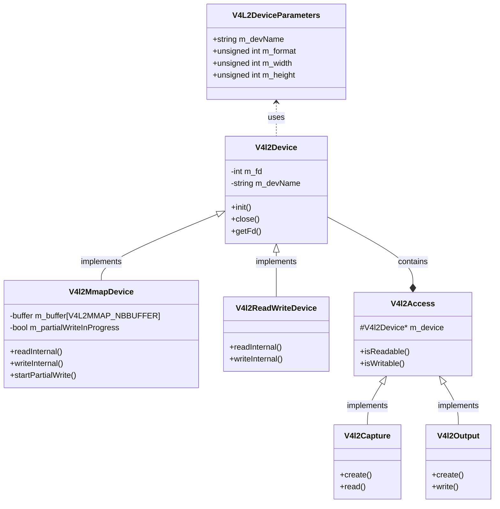

# libv4l2cpp

这是一个 V4L2(Video4Linux2) 的 C++ 封装库，用于简化 Linux 下视频设备的操作。该库提供了面向对象的接口，使视频采集和输出操作更加简单和安全。

## 功能特性

- 支持视频设备的捕获和输出
- 支持两种 I/O 模式:
  - MMAP(内存映射)模式
  - Read/Write(读写)模式
- 支持设置视频格式、分辨率和帧率
- 支持查询设备能力
- 支持部分写入操作(用于大数据分段传输)
- 自动管理缓冲区生命周期

## 依赖关系

- Linux 内核支持 V4L2
- libv4l2 开发库
- log4cpp (可选,用于日志记录)

## 数据流和内存拷贝分析

### MMAP 模式 (推荐)

1. 内核空间到用户空间的数据传递:
   - 驱动分配连续的物理内存作为缓冲区
   - 通过 mmap 系统调用将内核缓冲区映射到用户空间
   - 应用程序可以直接访问这些缓冲区,无需额外拷贝
   - 每帧数据只发生一次内存映射,没有实际的数据拷贝

数据流程:
```
硬件 -> 驱动缓冲区(内核空间) <-映射-> 应用程序缓冲区(用户空间)
```

### Read/Write 模式

1. 内核空间到用户空间的数据传递:
   - 驱动将数据写入内核缓冲区
   - read() 系统调用将数据从内核缓冲区拷贝到用户空间
   - 每帧数据发生一次完整的内存拷贝

数据流程:
```
硬件 -> 驱动缓冲区(内核空间) -拷贝-> 应用程序缓冲区(用户空间)
```

## 核心类说明



### V4l2Device

基础设备类,实现了:
- 设备的打开/关闭
- 格式设置
- 参数配置
- 能力查询

### V4l2MmapDevice

MMAP 模式的设备实现:
- 管理内存映射的缓冲区
- 实现零拷贝数据传输
- 支持部分写入操作

### V4l2ReadWriteDevice 

Read/Write 模式的设备实现:
- 使用系统调用读写数据
- 实现更简单但效率较低

### V4l2Capture/V4l2Output

设备访问封装:
- 封装了读写操作
- 提供设备状态查询
- 管理设备生命周期

## 使用示例

### 1. 创建捕获设备

```cpp
// 使用 MMAP 模式打开摄像头
V4L2DeviceParameters param("/dev/video0", V4L2_PIX_FMT_YUYV, 640, 480, 30, IOTYPE_MMAP);
V4l2Capture* capture = V4l2Capture::create(param);
```

### 2. 读取视频帧

```cpp
char buffer[WIDTH * HEIGHT * 2];
timeval tv;
tv.tv_sec = 1;
tv.tv_usec = 0;

// 等待数据可读
if (capture->isReadable(&tv)) {
    // 读取一帧数据
    size_t size = capture->read(buffer, sizeof(buffer));
    if (size > 0) {
        // 处理视频帧...
    }
}
```

## 性能优化建议

1. 优先使用 MMAP 模式:
   - 避免不必要的数据拷贝
   - 降低 CPU 使用率
   - 提高数据传输效率

2. 合理设置缓冲区数量:
   - MMAP 模式默认使用多个缓冲区
   - 可以平衡延迟和资源使用

3. 使用部分写入功能:
   - 处理大数据时避免一次性分配大内存
   - 支持流式处理

## 限制和注意事项

1. 设备兼容性:
   - 需要设备驱动支持 V4L2
   - 部分功能可能需要特定的驱动支持

2. 错误处理:
   - 所有操作都应检查返回值
   - 使用日志功能记录错误信息

3. 资源管理:
   - 正确关闭设备
   - 及时释放缓冲区
   - 处理好设备的异常断开

## 故障排除

1. 设备打开失败:
   - 检查设备文件权限
   - 确认设备是否被其他程序占用

2. 格式设置失败:
   - 查询设备支持的格式
   - 确认请求的分辨率是否受支持

3. 读取数据失败:
   - 检查缓冲区大小是否足够
   - 确认设备是否正常工作

## 开发说明

项目遵循以下原则:
- 代码在公共领域
- 无技术支持
- 按原样提供
- 无明示或暗示的保证

## 许可证

本软件位于公共领域,可自由使用,修改和分发。